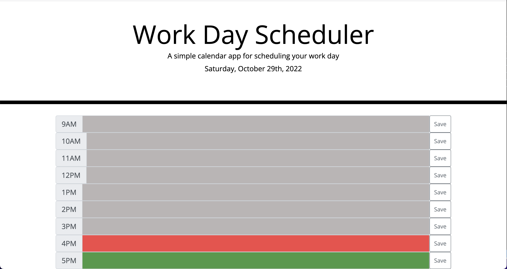

# Workday Scheduler

## Description

The Workday Schedule is an application that allows you to add a task for each hour of the workday and save it. When you come back to the page your entries are saved and display automatically until you overwrite them. I designed it using Bootstrap input groups and JQuery to practice my skills with those 3rd party APIs.

[Link To Page](https://asreedy82.github.io/workday-scheduler-challenge/)

## Installation

N/A

## Usage

The application displays today's date and time. It also color-codes each hour to show if the hour is in the past, present or future with grey for past hours, red for present, and green for future. To use the app, just enter the task you need completed for the hour it needs to be done then click 'save'. If you close the tab or window, the saved entries will be there when you return (unless you clear your cache).

## Credits

N/A

## License

N/A

### Author: Anthony Reedy